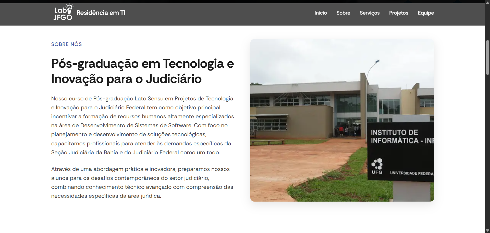
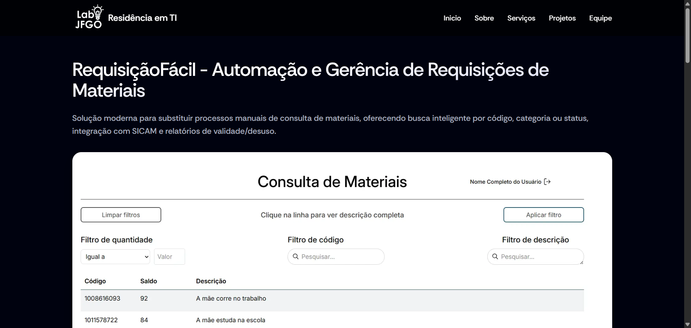
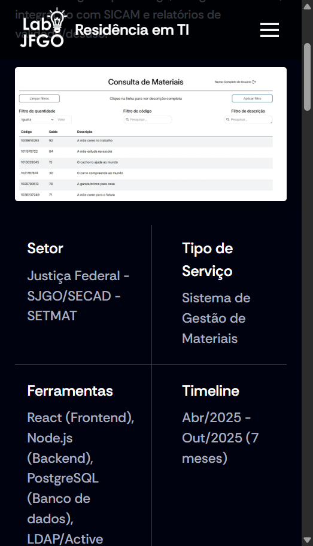

# Portal Institucional - Residência em TI (Judiciário Federal)


## 📸 Visualização do Portal

Abaixo estão as prévias das principais interfaces do portal institucional.

### 1. Home & Apresentação



### 2. Grid de Projetos (O Ecossistema)




### 3. Responsividade (Mobile)
<div style="display: flex; gap: 10px;">
  
</div>

---

## 💻 Sobre o Projeto

Este projeto é a **Plataforma Web Institucional** desenvolvida para centralizar e apresentar o ecossistema de inovação da **Residência em TI do Judiciário Federal**. 

O objetivo foi criar um Hub único onde servidores, magistrados e o público pudessem acessar informações detalhadas sobre as 6 grandes soluções desenvolvidas no programa (AgendaFácil, LicitaFácil, GestãoFácil, FolhaFácil, FrotaFácil e RequisiçãoFácil).

Diferente de um site estático comum, este portal utiliza **Server-Side Rendering (SSR)** para garantir máxima performance, SEO otimizado e acessibilidade seguindo os rigorosos padrões governamentais.

## 🚀 O Ecossistema Conectado

O portal serve como porta de entrada para os seguintes sistemas:

- **AgendaFácil:** Assistência em agendamento de audiências.
- **LicitaFácil:** Automação e gerência de compras e licitações.
- **GestãoFácil:** Gestão e fiscalização de contratos.
- **FolhaFácil:** Modernização da folha de pagamento.
- **FrotaFácil:** Controle e gestão da frota de veículos oficiais.
- **RequisiçãoFácil:** Automação de requisições de materiais.

## 🛠 Tecnologias & Arquitetura

O projeto foi construído com uma stack moderna focada em escalabilidade e manutenibilidade:

- **[Next.js](https://nextjs.org/)**: Framework React para produção, utilizado para SSR e rotas otimizadas.
- **[TypeScript](https://www.typescriptlang.org/)**: Tipagem estática para maior segurança e qualidade de código.
- **[React](https://reactjs.org/)**: Biblioteca para construção de interfaces componentizadas.
- **[Docker](https://www.docker.com/)**: Containerização da aplicação para garantir consistência entre ambientes.
- **[AWS](https://aws.amazon.com/)**: Infraestrutura de nuvem para hospedagem e serviços.
- **[Vercel](https://vercel.com/)**: Plataforma de deploy e hosting frontend.

## 🏆 Realizações Técnicas

Durante o desenvolvimento, os seguintes desafios foram superados:

* **Arquitetura SSR:** Implementação de renderização no servidor para carregamento instantâneo e melhor indexação (SEO).
* **Pipeline CI/CD:** Configuração de esteira de deploy automatizado utilizando Docker e AWS, garantindo entregas contínuas e seguras.
* **Design System:** Criação de componentes reutilizáveis e responsivos que mantêm a identidade visual do Judiciário.
* **Acessibilidade:** Aplicação estrita de diretrizes de acessibilidade web (WCAG) para inclusão digital.

## 📦 Como Executar Localmente

```bash
# Clone este repositório
git clone [https://github.com/ViniciusBenevides/Estrutura-JF.git](https://github.com/ViniciusBenevides/Estrutura-JF.git)

# Acesse a pasta do projeto
cd Estrutura-JF

# Instale as dependências
npm install
# ou
yarn install

# Execute o servidor de desenvolvimento
npm run dev
# ou
yarn dev