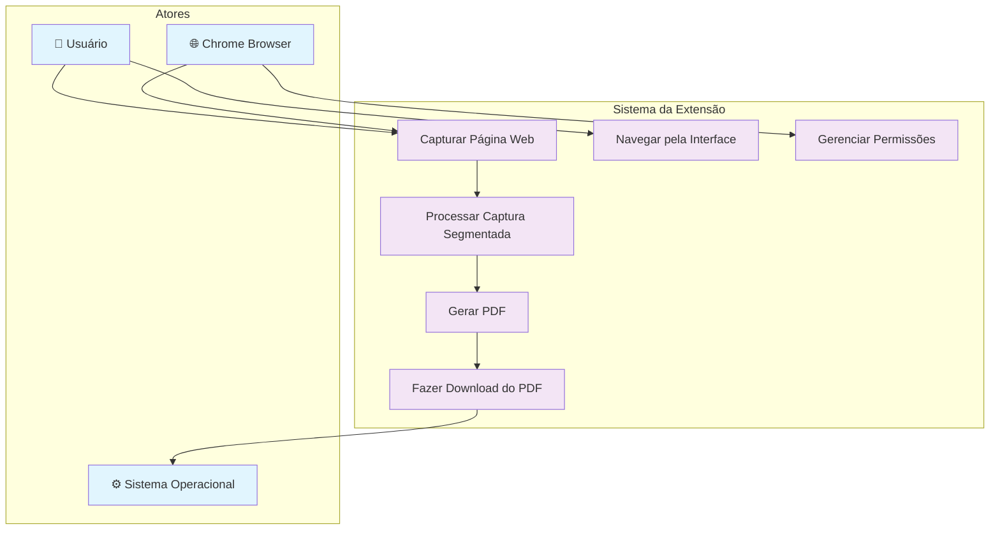
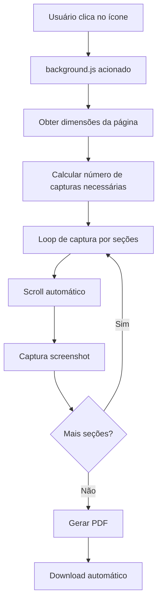

# Extensão de Captura - Documentação Técnica para Desenvolvedores

## 📋 Casos de Uso

### Diagrama de Casos de Uso



### Descrição dos Casos de Uso

#### UC1 - Capturar Página Web
- **Ator Principal**: Usuário
- **Pré-condições**: Extensão instalada, página web aberta
- **Fluxo Principal**:
  1. Usuário clica no ícone da extensão
  2. Sistema obtém dimensões da página ativa
  3. Sistema calcula número de capturas necessárias
  4. Sistema executa captura segmentada
- **Pós-condições**: Imagens da página capturadas

#### UC2 - Gerar PDF
- **Ator Principal**: Sistema
- **Pré-condições**: Capturas realizadas com sucesso
- **Fluxo Principal**:
  1. Sistema processa array de imagens
  2. Sistema utiliza jsPDF para criar documento
  3. Sistema gera ArrayBuffer do PDF
- **Pós-condições**: PDF gerado em memória

#### UC3 - Fazer Download do PDF
- **Ator Principal**: Sistema Operacional
- **Pré-condições**: PDF gerado
- **Fluxo Principal**:
  1. Sistema cria URL blob do PDF
  2. Sistema aciona Chrome Downloads API
  3. Sistema operacional salva arquivo
- **Pós-condições**: Arquivo PDF salvo localmente

#### UC4 - Navegar pela Interface
- **Ator Principal**: Usuário
- **Pré-condições**: Popup da extensão aberto
- **Fluxo Principal**:
  1. Usuário visualiza botão "Capturar Página Web"
  2. Usuário clica no botão
  3. Sistema dispara ação de captura
- **Pós-condições**: Processo de captura iniciado

#### UC5 - Processar Captura Segmentada
- **Ator Principal**: Chrome Browser
- **Pré-condições**: Página carregada, permissões concedidas
- **Fluxo Principal**:
  1. Sistema faz scroll automático da página
  2. Chrome captura screenshot da área visível
  3. Sistema repete processo até cobrir toda a página
- **Pós-condições**: Todas as seções da página capturadas

#### UC6 - Gerenciar Permissões
- **Ator Principal**: Chrome Browser
- **Pré-condições**: Extensão instalada
- **Fluxo Principal**:
  1. Chrome verifica permissões necessárias
  2. Sistema solicita acesso se necessário
  3. Chrome concede/nega permissões
- **Pós-condições**: Permissões configuradas

## 🏗️ Arquitetura

Esta extensão Chrome utiliza **Manifest V3** e implementa um sistema de captura de páginas web completas com conversão para PDF através de uma arquitetura baseada em service workers.

### Componentes Principais

```
├── manifest.json      # Configuração da extensão (Manifest V3)
├── background.js      # Service Worker principal
├── popup.html         # Interface do usuário
├── popup.js          # Lógica da interface
└── icon.png          # Ícone da extensão
```

## 🔧 Tecnologias Utilizadas

- **Chrome Extension API** (Manifest V3)
- **Service Workers** para processamento em background
- **Chrome Scripting API** para injeção de código
- **Chrome Tabs API** para captura de screenshots
- **Chrome Downloads API** para salvamento de arquivos
- **jsPDF** (dependência externa) para geração de PDFs

## 📋 APIs e Permissões

### Permissões Necessárias
```json
{
  "permissions": ["scripting", "activeTab", "tabs", "downloads"],
  "host_permissions": ["<all_urls>"]
}
```

- **`scripting`**: Injeção de código JavaScript nas páginas
- **`activeTab`**: Acesso à aba ativa atual
- **`tabs`**: Captura de screenshots e manipulação de abas
- **`downloads`**: Salvamento automático de arquivos
- **`<all_urls>`**: Acesso a todas as URLs para captura

### APIs Utilizadas

#### Chrome Scripting API
```javascript
chrome.scripting.executeScript({
  target: { tabId: tab.id },
  func: () => { /* código injetado */ }
})
```

#### Chrome Tabs API
```javascript
chrome.tabs.captureVisibleTab(tab.windowId, {
  format: "png"
})
```

#### Chrome Downloads API
```javascript
chrome.downloads.download({
  url: blobUrl,
  filename: "pagina_capturada.pdf"
})
```

## 🔄 Fluxo de Execução

### 1. Inicialização
- Service worker registrado via `background.js`
- Event listener configurado para `chrome.action.onClicked`

### 2. Processo de Captura


### 3. Algoritmo de Captura Segmentada
```javascript
for (let y = 0; y < height; y += viewportHeight) {
  // Scroll para posição Y
  await chrome.scripting.executeScript({
    target: { tabId: tab.id },
    func: (scrollY) => window.scrollTo(0, scrollY),
    args: [y]
  });
  
  // Captura da seção visível
  const dataUrl = await chrome.tabs.captureVisibleTab(tab.windowId, {
    format: "png"
  });
  
  capturedImages.push(dataUrl);
}
```

## 🛠️ Configuração de Desenvolvimento

### Pré-requisitos
- Google Chrome (versão 88+)
- Editor de código (VS Code recomendado)
- Conhecimento em JavaScript ES6+

### Setup Local
1. Clone/baixe o projeto
2. Abra `chrome://extensions/`
3. Ative "Modo do desenvolvedor"
4. Clique em "Carregar sem compactação"
5. Selecione a pasta do projeto

### Debugging
- **Console do Service Worker**: `chrome://extensions/` → Detalhes → "Inspecionar visualizações" → service worker
- **Console da Página**: F12 na página onde a extensão está sendo testada
- **Logs**: Todos os logs estão no `background.js` via `console.log()`

## 🔍 Estrutura do Código

### background.js
**Função Principal**: `chrome.action.onClicked.addListener()`
- Gerencia o fluxo completo de captura
- Calcula dimensões da página
- Executa loop de captura segmentada
- Gera PDF final

**Função Auxiliar**: `generatePdf()`
- Utiliza jsPDF para criação do documento
- Processa array de imagens capturadas
- Retorna ArrayBuffer do PDF

### popup.js
- Interface simples com event listener
- Dispara a ação principal via `chrome.action.onClicked.dispatch()`

### manifest.json
- Configuração Manifest V3
- Definição de permissões e service worker
- Configuração da action (popup + ícone)

## ⚡ Otimizações Implementadas

### Performance
- **Captura assíncrona**: Uso de `async/await` para operações não-bloqueantes
- **Processamento em chunks**: Captura por seções para evitar timeout
- **Device Pixel Ratio**: Consideração da densidade de pixels para qualidade

### Memória
- **Cleanup automático**: URLs de blob são gerenciados automaticamente
- **Processamento sequencial**: Evita sobrecarga de memória com múltiplas capturas simultâneas

## 🐛 Debugging e Troubleshooting

### Problemas Comuns

#### 1. Erro de Permissões
```javascript
// Verificar se as permissões estão concedidas
chrome.permissions.contains({
  permissions: ['scripting', 'activeTab']
}, (result) => {
  console.log('Permissões:', result);
});
```

#### 2. Falha na Captura
- Verificar se `tab.id` existe
- Confirmar se a página carregou completamente
- Checar políticas CSP da página

#### 3. Erro na Geração de PDF
- Verificar se jsPDF está carregado
- Confirmar formato das imagens (base64 data URLs)
- Validar dimensões calculadas

### Logs de Debug
```javascript
console.log("Dimensões:", width, height, "DPR:", devicePixelRatio);
console.log(`Capturando parte da página na posição Y: ${y}`);
console.log("PDF gerado. Salvando arquivo...");
```

## 🔄 Extensibilidade

### Adicionando Novos Formatos
```javascript
// Exemplo: Suporte a JPEG
const dataUrl = await chrome.tabs.captureVisibleTab(tab.windowId, {
  format: "jpeg",
  quality: 90
});
```

### Configurações Personalizáveis
```javascript
const config = {
  format: "png", // ou "jpeg"
  quality: 100,
  filename: "custom_name.pdf",
  pageSize: "A4" // ou "letter", "legal"
};
```

### Hooks para Extensão
```javascript
// Antes da captura
beforeCapture(tab, dimensions);

// Após cada screenshot
afterScreenshot(dataUrl, position);

// Antes da geração do PDF
beforePdfGeneration(images);

// Após download
afterDownload(filename);
```

## 📊 Métricas e Monitoramento

### Performance Tracking
```javascript
const startTime = performance.now();
// ... processo de captura
const endTime = performance.now();
console.log(`Captura concluída em ${endTime - startTime}ms`);
```

### Error Tracking
```javascript
try {
  // processo de captura
} catch (error) {
  console.error("Erro detalhado:", {
    message: error.message,
    stack: error.stack,
    tabId: tab.id,
    url: tab.url
  });
}
```

## 🚀 Build e Deploy

### Empacotamento
```bash
# Criar arquivo .zip para Chrome Web Store
zip -r extensao-captura.zip . -x "*.git*" "README-DEV.md" "node_modules/*"
```

### Validação
- Testar em diferentes tipos de página
- Verificar compatibilidade com Chrome versions
- Validar permissões mínimas necessárias

## 📝 Contribuição

### Code Style
- ES6+ syntax
- Async/await para operações assíncronas
- Comentários em português
- Console.log para debugging

### Testing
- Testar em páginas longas (>10000px)
- Verificar em diferentes resoluções
- Validar com conteúdo dinâmico
- Testar políticas CSP restritivas

---

**Versão**: 1.0  
**Manifest Version**: 3  
**Chrome API**: Extensions API  
**Dependências**: jsPDF (externa)
